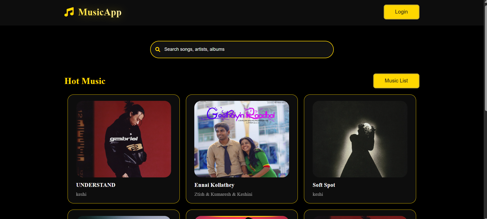

# 🎵 Music App

A sleek and responsive music application that lets users search and explore music tracks with a premium black and yellow theme. Built for performance and styled for elegance.

 

## 🌟 Features

- 🎧 Search your favorite music tracks
- 🔍 Smooth and intuitive UI with search animation
- 🖤 Premium dark theme with gold and yellow accents
- 🖼️ Track cards with album art and info
- 💻 Fully responsive and mobile-friendly design

## 🚀 Tech Stack

- **HTML5**
- **CSS3**
- **JavaScript**
- Optionally integrated with external music APIs (e.g., Spotify API)

## 🛠️ Installation

1. Clone the repository:
   ```bash
   git clone https://github.com/nikitayadav19/musicapp.git
2. Navigate into the project directory:
Navigate into the project directory:

   ```bash
   cd musicapp
3. Open index.html in your browser.

No build tools or frameworks required — it's a pure frontend project!

🎨 Theme
Primary Color: #FFD700 (Gold)

Accent Colors: #000000 (Black), #1a1a1a (Dark Grey), #ffffff (White)

Font: Sans-serif modern fonts for clean readability

📸 Screenshots
(Insert screenshot here if available)

📂 Project Structure

    ```bash
     musicapp/
     │
     ├── index.html
     ├── style.css
     ├── script.js (optional)
     └── assets/
         └── images/


    
🧪 Future Enhancements
Music playback support

Playlist creation

Backend integration for storing user preferences

Live search with real-time APIs

🙋‍♀️ Author
Nikita Yadav
🔗 GitHub 

📄 License
This project is open-source and available under the MIT License.


